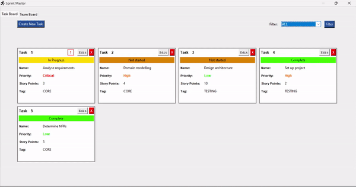
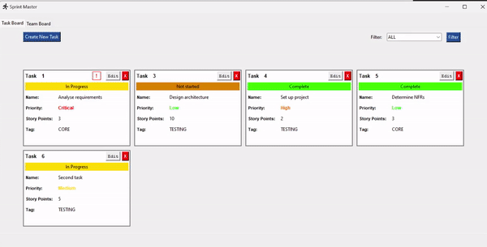

# Sprint Master

## Table of Contents

[About](#about) 
[Preview](#preview) 
[Use Instructions](#use) 
[Additional Information](#info) 

## About <a name="about">
Sprint Master is a digital task organising tool for Agile teams to keep track of a project’s progress by displaying ongoing tasks as a collection of compact, information-rich cards which presents essential information at a glance. Task details are safely stored in these cards and may be quickly modified as the project evolves without the hassle of traditional documentation or processes such as keeping paperwork up to date. 

#### Feautres:
- Keep a record of the project team and all its participating members.
- Create customisable task cards, with each card including details such as a name, description, story points, priority, status, asignee and tags.
- Modify or delete task cards as the project progresses or requirements change.

## Preview <a name="preview">

#### An empty Team Board

#### An empty Task Board

#### Adding someone to the team

#### Creating and deleting tasks

#### Editing a task

#### Filtering tasks by type

## Use Instructions <a name="use">

#### Download
1. At the top of [this repository page](https://github.com/carsnl/SprintMaster), click **Code** > **Download ZIP**
2. Unzip the downloaded file.
3. Open the file and click on the **SprintMaster.exe** application file to launch the program. This may take a few seconds.

#### Using the application

##### Task Board and Team Board
- Navigate between the Task Board and Team Board by clicking on the tabs at the top left corner.
- The Team Board lists individuals currently part of the team. 
- The Task Board displays all tasks that have been created.

##### Managing Team Members
- To add someone to the team, click on "Add Team Member" and fill in the required particulars. 
- A team member can be removed by clicking on "X" beside their name and email in the table.

#### Managing Tasks
- To assign a task to an individual, there must be at least one member in the team.
- To add a task, click on "Create Task" and fill in the required particulars. Note that "Story Points" only accepts numerical inputs.
- To edit a task, click on "Edit" on the relevant task and update its details.
- To delete a task, click on "X" on the relevant task.
- To filter tasks, select the desired filter using the drop down menu found at the top right of the Task Board. Click "Filter" to apply.

## Additional Information <a name="info">

This final application presented in this repository is an adapted version from a university project. Developed in collaboration with Shyam Kamalesh Borkar, Chang Lin Ong and Tiong Yue Khoo.

For enquires, contact [laicarson.swe@gmail.com](laicarson.swe@gmail.com).    
